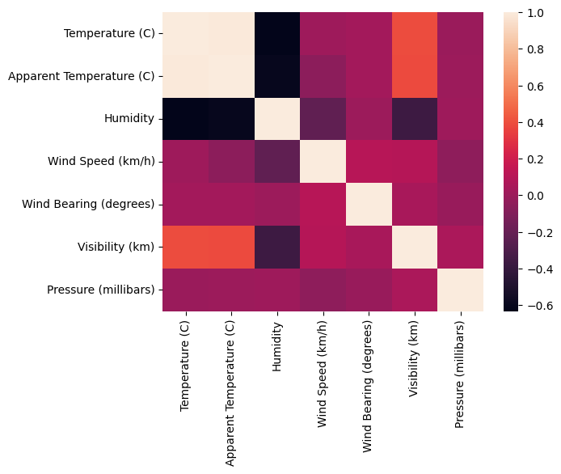

# Linear_Regression
    Linear regression on weather history data.

- Data Preparation
- Exploration
- Model Training

### Multivariate Correlation Heatmap Analysis for Weather Data

## Summary
    This Python code utilizes linear regression to analyze a weather dataset, encompassing data preparation, exploratory data analysis (EDA), model training, and evaluation. Initially, the dataset undergoes preprocessing steps to handle missing values, normalize features, and encode categorical variables. 
    
    EDA techniques are then applied to understand the relationships between variables, identify outliers, and select relevant features. Two separate models are trained using three and five features, respectively, to predict a target variable (temperature). Model training involves splitting the dataset into training and testing subsets, fitting the linear regression model to the training data, and assessing its performance on the test set. Evaluation metrics such as mean squared error (MSE) and R-squared are computed to quantify model accuracy and goodness of fit, providing insights into the predictive capability of the linear regression models for weather forecasting tasks.
